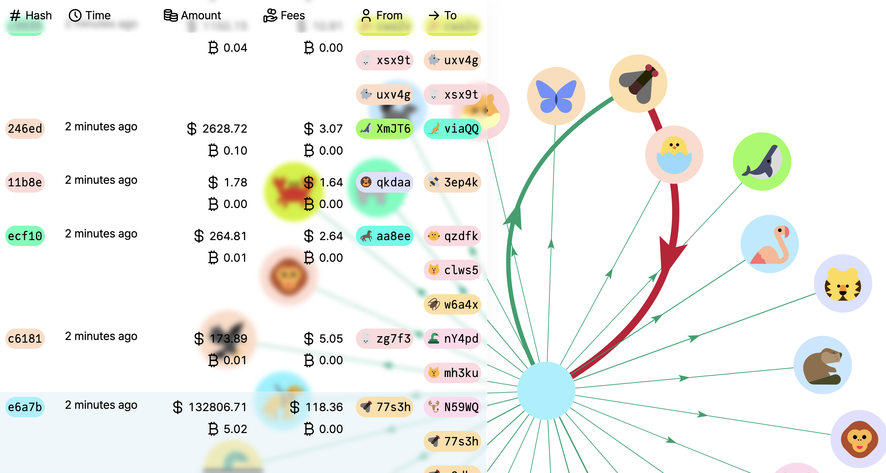
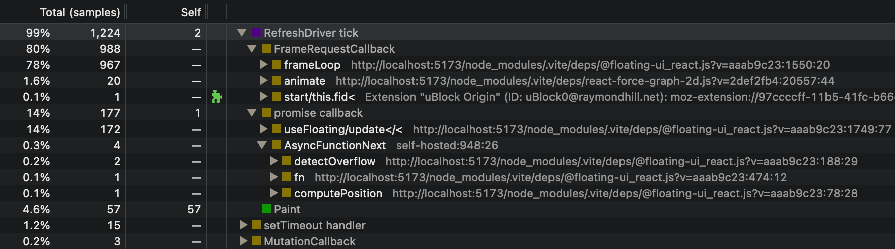

# Real-time bitcoin dashboard – [Demo](https://bitcoin-dashboard.pages.dev/)



This is an experimental real-time bitcoin dashboard built in two days.

## Instructions

### Installation

This uses pnpm as the package manager. Please follow the installation instructions [here](https://pnpm.io/installation), then run:

```
pnpm install
```

### Development

```sh
pnpm dev
```

This runs the local development server at `http://localhost:5173/`. You can also run the test suite in watch mode with `pnpm test`.

### Production

```sh
pnpm test run && pnpm build
```

The build can be found in the `dist` folder.

## Design

### Transactions

I begin with the end in mind: making the goal explicit creates a metric for success. Here, I want to visualise the latest transactions on the bitcoin network. Among what we may want to see:

1. The hash and timestamp: whether the transaction is the one we are looking for
2. The amount and fees: how much is being transferred and paid
3. Inputs and outputs: who is sending and receiving the money

Both (1) and (2) require a fixed space, and are best represented as a table. (3) has a variable length, and another visualisation is needed.

### Inputs and outputs

Here, we want to see, in the blink of an eye, who contributes the most. A pie/bar chart would be possible, but it would then separate an address if it sends and receives money within the same transaction. A node graph would be more appropriate, as it can show the flow of money, and maximises the use of space.

## Challenges

### Identifying addresses

Addresses are a long string. It takes time to read it, and mistakes easily happen. I decomposed an address using other ways of communicating information:

- **Colour**: an address is hashed deterministically to obtain a number, which is the hue of the colour. Using the novel [HCT colour space](https://www.fonearena.com/blog/356853/google-hct-colour-system-android-material-design.html), we can maintain a constant lightness and saturation for maximal readability.

- **Shape**: the shape is chosen among [geometric emojis](https://toss.im/tossface/all), which are easy to recognise at a small scale and match the style of the [typeface](https://rsms.me/inter/). I limited the emojis to animals, like the icons of Google users when editing a document, because seeing a cake sending money to a foot might be more puzzling.

Note: the colour scheme is facultative for colour-blind persons. The arrows, coloured according to the [Natural Colour System](https://ncscolour.com/ncs/), show their direction with their arrows.

### Limited space

The main challenge is to display a lot of information in a small space. I used the following techniques:

- **Contextual information**: since two addresses can have the same hash, I still display the last 5 characters, and hovering shows the full address / transaction hash. Similarly, a lot of information can be displayed through tooltips: the bitcoin price at the time of the transaction, the absolute time, etc. I decided to show both the USD and BTC amounts at all times, as I expect the user to often want to see the price in one of the currencies without moving the mouse.

- **Glass**: blurred backgrounds show what is behind, and can still be read. Here, we can still see the transactions under the table.

- **Responsive sizes**: on small screens, the interactive part of the graph might be too small. I decided to make the size of the interface proportional to the width of the screen.


## Future improvements



- **Performance**: here, we are limited by [the Floating UI library](https://floating-ui.com/). It is the biggest performance cost according to the performance trace (rows with `@floating-ui`): for 8000 rows, 92.3% of the total computation! At each update, each potential tooltip calls `getBoundingClientRect`. Currently, I display only the 500 latest transactions. Possible improvements here: since only one tooltip is displayed at a time, we could calculate the bounding rectangle only once. We could also virtualise the list.

- **User-friendliness**: currently, new entries displace suddenly all the other entries, and the user must scroll down to find the old ones. Worse: if the mouse was hovering over a particular transaction, after the displacement, it may hover over another transaction, and the old one would be lost. The current CSS trick to anchor the scroll position [does not work in Safari](https://caniuse.com/css-overflow-anchor), and only works when the user has already scrolled. Ideally, the table would retain the scroll position.

- **Minor features**: mobile and dark modes, a way to filter the transactions, etc.
